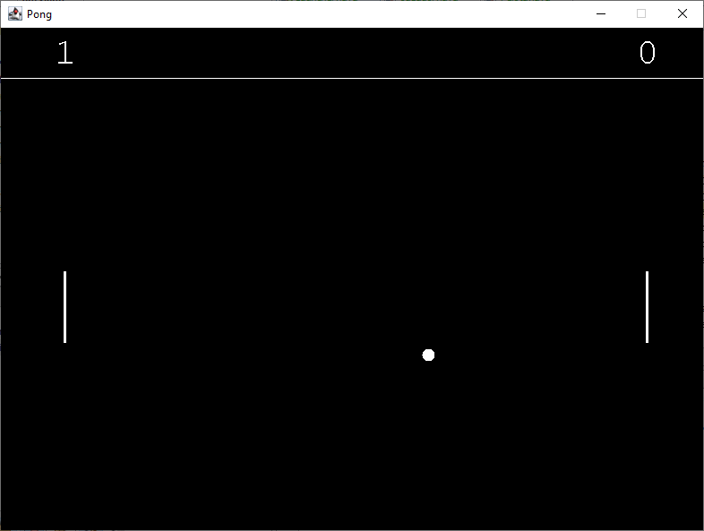

# Raqueta
El juego contiene una pelota y dos raquetas
* Si las raquetas dejan pasar la pelota, el puntaje malo sube.
* Si las raquetas hacen rebotar la pelota, el puntaje bueno sube.

## Instrucciones
1. Flecha arriba: Mueve las raquetas
2. Flecha abajo: Cierra el programa
